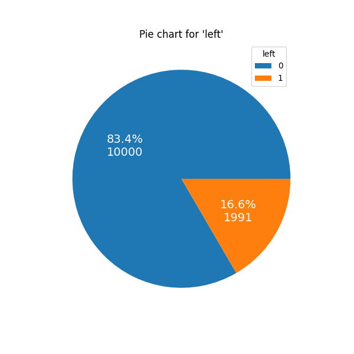
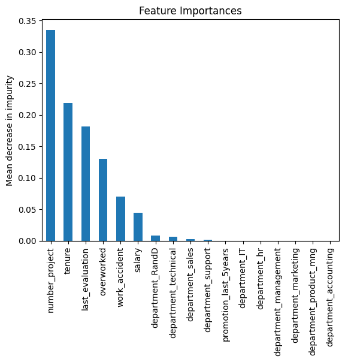

# Predicting Employee Turnover

### Overview

The goal of this project was to create a predictive model for employee turnover through multiple logistic regression or through machine learning algorithms such as Decision Tree, Random Forest and eXtreme Gradient Boosting (XGBoost). This Google Advanced Data Analytics Professional Certificate capstone project utilized employee statistics from the fictional company Salifort Motors. The best model for this analysis was XGBoost with tuned hyperparameters. The metrics below are the metrics for the model's success on the test set:

|Model Name|Precision|Recall|F1 Score|Accuracy|AUC
|:---:|:---:|:---:|:---:|:---:|:---:|
|XGBoost (with feature engineering)| 90.1%| 87.8%| 89.0%| 96.4%| 97.0%|

Using an XGBoost (FE) model, we see that the main predictive features in determining if an employee will leave are: `number_project`, `tenure`, `last_evaluation`, `overworked`, `work_accident` and `salary`.

### Business Understanding

Salifort’s senior leadership team is concerned about how many employees are leaving the company. The high turnover rate is costly in the financial sense because Salifort makes a big investment in recruiting, training, and upskilling its employees. If Salifort could predict whether an employee will leave the company, and discover the reasons behind their departure, they could better understand the problem and develop a solution.

### Data Understanding

The fictional company's data came from [Kaggle](https://www.kaggle.com/datasets/mfaisalqureshi/hr-analytics-and-job-prediction?select=HR_comma_sep.csv) and is free to use according to this [license](https://creativecommons.org/publicdomain/zero/1.0/). The data consisted of approximately 12k unique employees and 10 features per employee. The features included information on employee satisfaction, evaluation score, number of projects contributed to, average number of hours worked per month, tenure at the company, whether if they had a work accident, if they were promoted within the last 5 years, department worked for, and salary. The pie chart below shows the proportion of employees at Salifort Motors, with 0 meaning the employee has stayed and 1 meaning the employee has left.

    

### Modeling and Evaluation

An XGBoost model with tuned hyperparameters and feature engineering was used to determine feature importance in who would leave or stay at Salifort Motors. The below plot shows that the number of contributing projects, tenure with company, last evaluation score, working an average of over 175 hours per month, experiencing an accident, and salary are important factors.

    

### Conclusion

The XGBoost model that was developed can benefit Salifort Motors in knowing if an employee is leaving or not. Dedicating resources into the feature importance will limit employee turnover while promoting good work culture.
